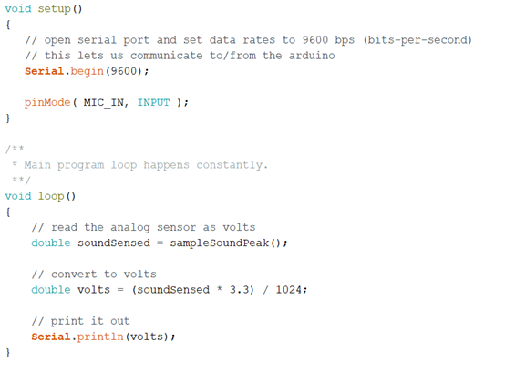
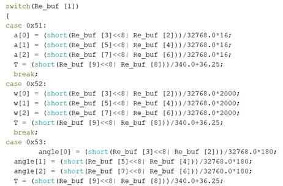

# Smart bracelet

brief: We use Raspberry Pi to simulate the hardware end of the smart bracelet, and developed a matching IOS client to view the collection information of the bracelet. The main functions of the bracelet are fall, cry detection, GPS positioning and alarm.

> This embedded development was done by me and my friend. The software part  can refer to the [link](https://github.com/Plorde/ChildLost) and I am responsible for the hardware part.

依赖环境：`Python`

所需硬件：`Raspberry Pi 3`,`树莓派GPS扩展板`,`MAX4466`声音传感器,`MPU6050`六轴陀螺仪,`Arduino`。

## 硬件连接

连接图如下：

### 哭闹监测

使用MAX4466声音传感器采集声音信息，通过arduino将模拟信息转化为数字信息，再传入树莓派进行阈值判断处理

### 摔倒监测

使用MPU6050六轴陀螺仪采集人体的加速度、角速度和角度信息，并将加速度信息进行再加工和处理来判断是否摔倒，具体算法参考文献实验数据实现。

### 地理位置

使用树莓派GPS扩展板，通过GPS定位获得原始经纬度，并将其转换为高德地图的加密后的经纬度，每隔5秒传给服务器。

## 代码简述

本项目使用python进行编程，其中涉及到了摔倒信息、哭闹信息以及GPS三种信息的POST服务器操作。所以，我们对`tumble`、`mot`、`cry`这三个类使用了多线程编程与观察者模式相结合的形式。而GPS模块，使用了厂商提供的`L76X`模块来直接获取地址信息。

`pibracket.py`是将所有模块都放在一起运行的代码。直接在树莓派中输入

> python pibracket.py

即可运行。

> 代码不包括声音检测部分，存档找不到了，只能贴张实验报告的图...

声音数据处理：

摔倒信息处理：

